# PRJCTR HW3: Resource monitoring systems

This project contains: TIG (telegraf, influxdb, grafana) stack which is monitoring FastAPI app with elasticsearch and mongodb services.

The full list of services:
* nginx
* python fastapi app
* mongodb
* elasticsearch
* grafana
* influx
* telegraf

## Start the stack with docker compose

```bash
$ docker-compose up
```

## Services description

### FastAPI App
- URL: http://localhost:8181/

### Grafana
- URL: http://localhost:8181/grafana
- User: admin 
- Password: admin 

### Telegraf
- Port: 8125 UDP (StatsD input)

### InfluxDB
- Port: 8086 (HTTP API)
- User: admin 
- Password: admin 
- Database: influx

### Elasticsearch
- Port: 9200

### MongoDB
- Port: 27017
- User: fast
- Password: api
- Database: fastapi

### Nginx
- Port: 80
- URL: http://localhost:8181/

### Docker socket file proxy
- Port: 2375


## Run the Apache Benchmarking tool

```bash
$ ab -n 100000 -c 100 http://127.0.0.1:8181/
```

### Results

```
Finished 100000 requests


Server Software:        nginx/1.23.3
Server Hostname:        127.0.0.1
Server Port:            8181

Document Path:          /
Document Length:        15 bytes

Concurrency Level:      100
Time taken for tests:   619.880 seconds
Complete requests:      100000
Failed requests:        0
Total transferred:      16400000 bytes
HTML transferred:       1500000 bytes
Requests per second:    161.32 [#/sec] (mean)
Time per request:       619.880 [ms] (mean)
Time per request:       6.199 [ms] (mean, across all concurrent requests)
Transfer rate:          25.84 [Kbytes/sec] received

Connection Times (ms)
              min  mean[+/-sd] median   max
Connect:        0    0   0.4      0      44
Processing:     8  619 537.7    590    4614
Waiting:        8  619 537.7    590    4614
Total:          8  619 537.7    591    4614

Percentage of the requests served within a certain time (ms)
  50%    591
  66%    738
  75%    799
  80%    842
  90%   1072
  95%   1882
  98%   2367
  99%   2592
 100%   4614 (longest request)
```

### Grafana Dashboards while benchmarking

#### FastAPI performance metrics

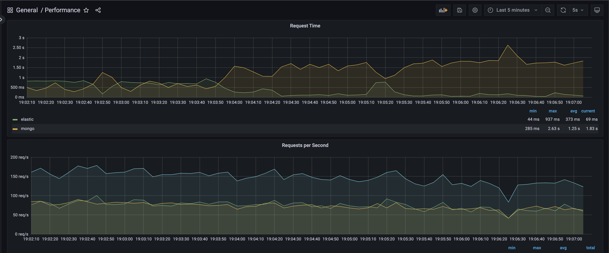

#### System metrics

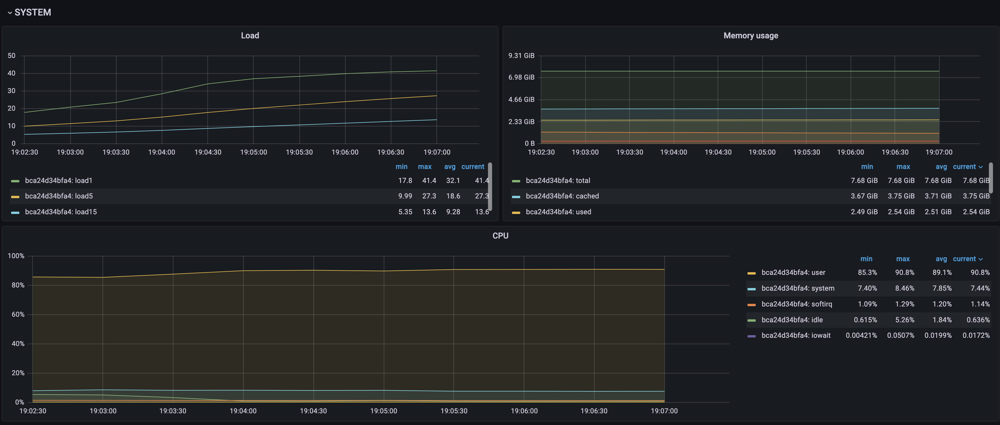

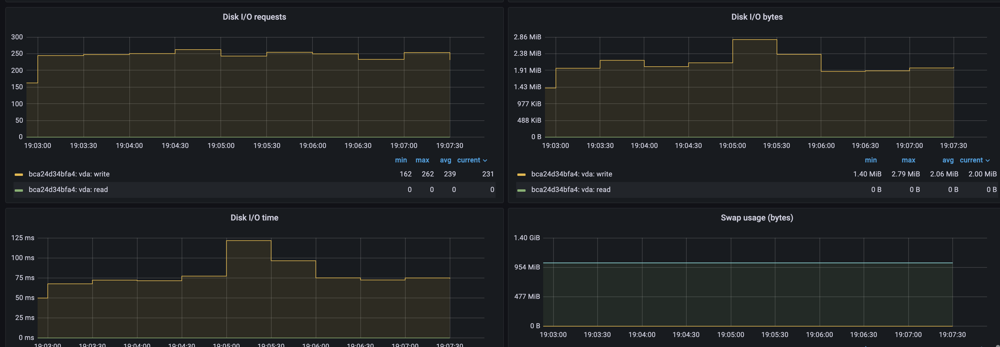

#### Nginx metrics

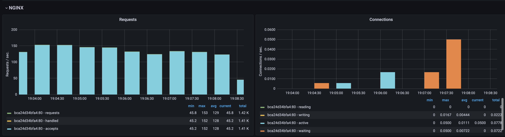

#### Elastic metrics

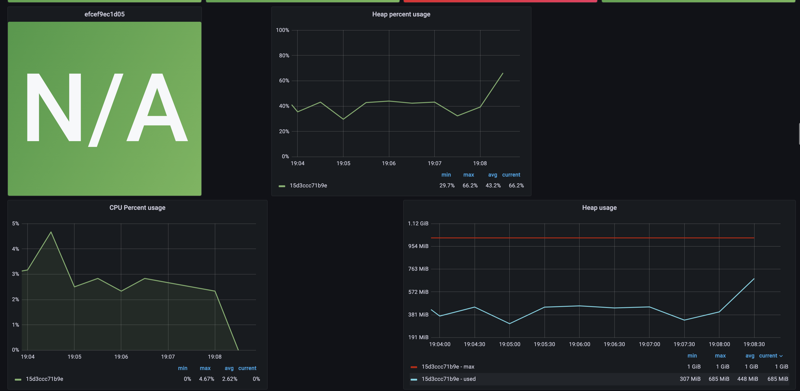

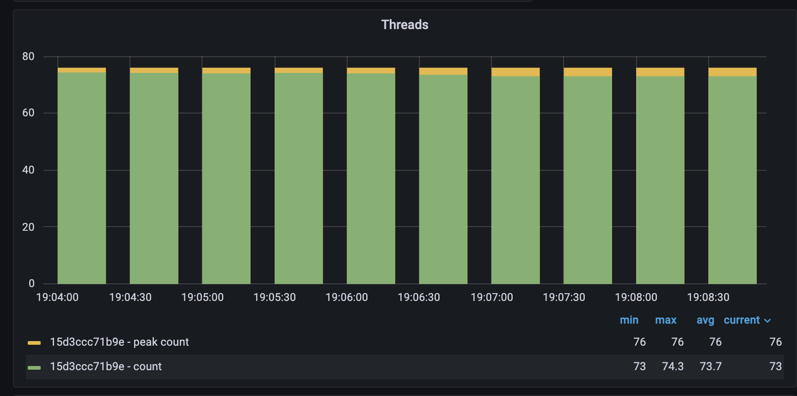

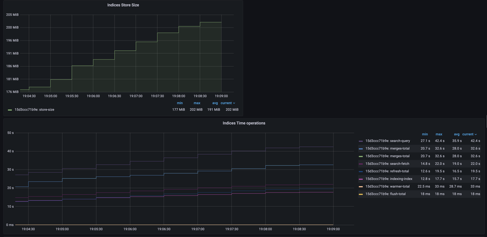

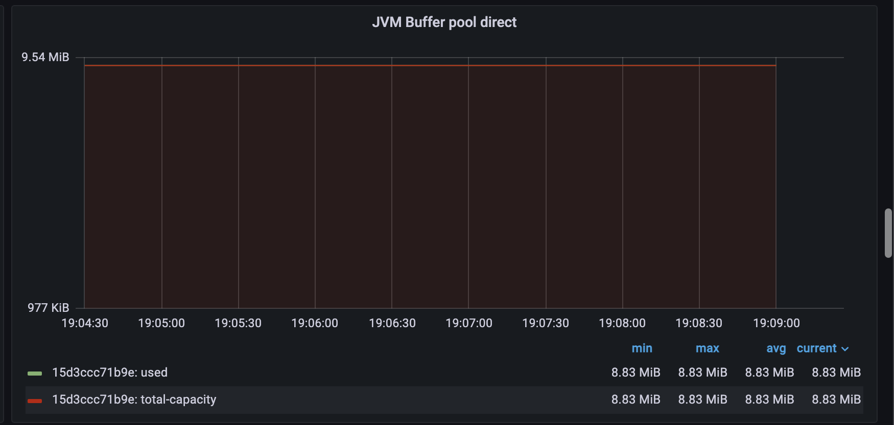

#### Mongo metrics

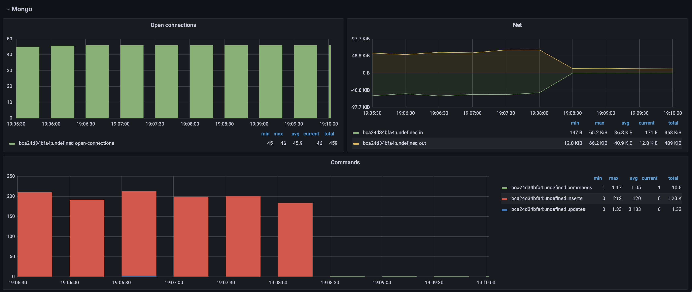

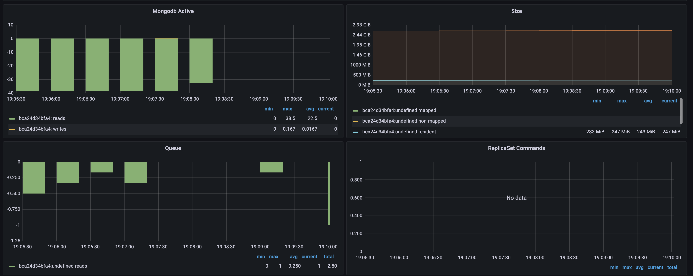

#### Docker metrics

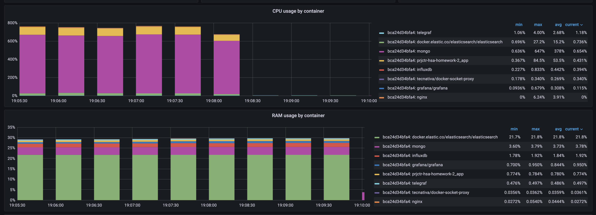

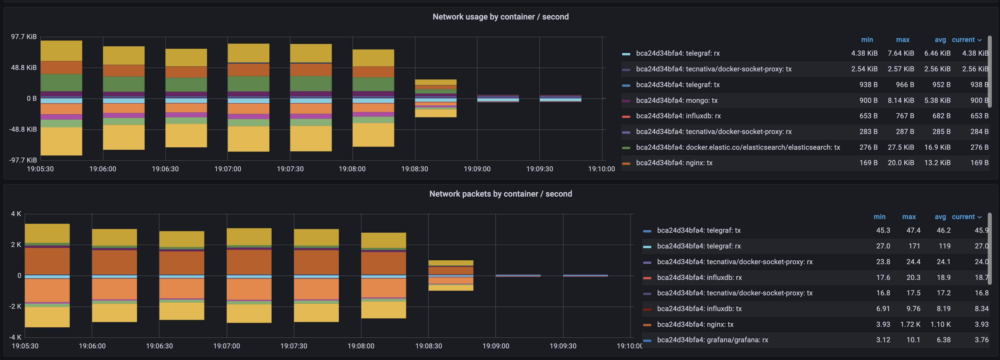
